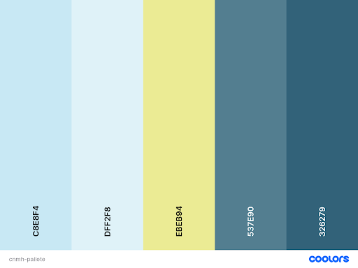

# charte graphique 

- cnmh logo

  - cnmh logo
 
- cnmh logo
 

 

  
### Palette du coleurs 

    - CBE8F4
    -  DFF2F8
    -   EBEB94
    -   537E90
    -   326279

  
  

 #### Font :
[ROBOTO](https://fonts.google.com/specimen/Roboto)

 ### NB Le fond de la présentation doit rester blanc en raison du diagramme UML

  [adobe](https://color.adobe.com/fr/boom-color-theme-9a19b0ba-edea-435a-8b8c-62316972504c/ ) 
  [colors](https://coolors.co/)
